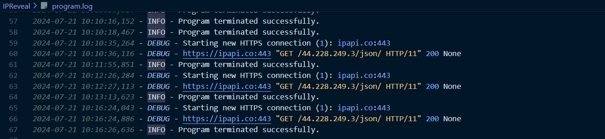

# IPReveal

**IPReveal** is a Python tool designed to fetch and display geolocation information for a given IP address. It provides a user-friendly interface with color-coded outputs and handles errors gracefully. The script includes logging for tracking execution and issues.

## Features

- **Fetch IP Geolocation**: Retrieves and displays geolocation information for any given IP address.
- **Colorful Output**: Utilizes colorama for a vibrant, colorful user interface.
- **Error Handling**: Includes comprehensive error handling and logging.
- **Typing Effect**: Provides a typing effect for text display to enhance user experience.
- **Cross-Platform Compatibility**: Works on both Windows and Unix-based systems.

  




## Installation

1. Clone the repository:
```bash
git clone https://github.com/kunalnamdas/IPReveal.git
cd IPReveal
   ```
2. Install the required dependencies:
  ```
  pip install -r requirements.txt
  ```
3  . If colorama is not already installed, it will be installed automatically by the script.
  ```
  pip install -r requirements.txt
  ```

## Usage
1. Run the script:
```
python ipreveal.py
```
2 . Follow the prompts to enter the target IP address and view the geolocation information.

3 . The script will ask if you want to continue after displaying the results. Enter y or yes to continue or n or no to exit.

## Dependencies

- colorama: For colored terminal text.

- ipapi: For IP geolocation lookup.

## Logging

The script logs its execution details and errors to program.log. This file is useful for debugging and tracking the script's performance.

## License

This project is licensed under the MIT License. See the LICENSE file for details.

## Contributing

Contributions are welcome! Please fork the repository and submit a pull request with your changes.

## Contact

For any questions or support, please reach out to kunalnamdas@gmail.com

## Acknowledgments

- Colorama: For providing the color functionality in the terminal.
  
- ipapi: For the IP geolocation service.

**Author**: Kunal Namdas

**GitHub**: @kunalnamdas


```bash

You can adjust the following in the `README.md`:

1. **Replace `yourusername`** with your GitHub username.
2. **Update `your-email@example.com`** with your actual contact email.
3. **Include a `requirements.txt`** if you want to list the dependencies explicitly.

Feel free to let me know if you need any changes or additional information!
```
